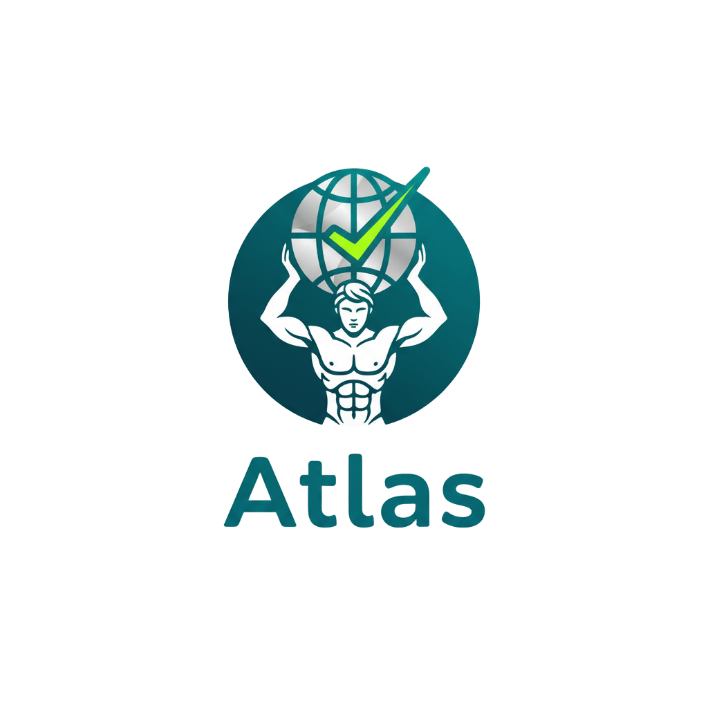

# Atlas - Seu Planejador de Treinos



## Sobre o Projeto

O Atlas é a sua agenda inteligente de treinos, projetada para ajudá-lo a planejar, organizar e monitorar suas rotinas de exercício de forma simples e eficiente. Com uma interface moderna, elegante e otimizada para o modo escuro, o Atlas torna a jornada de fitness mais agradável e motivadora.

---

## Funcionalidades

* **Splash Screen:** Uma tela de carregamento animada para uma experiência de boas-vindas suave.
* **Onboarding Interativo:** Telas de apresentação com animações e navegação intuitiva para guiar novos usuários.
* **Identidade Visual Coesa:** Design minimalista com uma paleta de cores consistente, destacando tons de verde/ciano e roxo em um tema escuro.
* **Planejamento de Treinos:** Gerencie seus exercícios e rotinas diárias com facilidade.
* **Monitoramento de Progresso:** Acompanhe seus avanços e supere seus próprios limites.

---

## Tecnologias

* **Flutter:** Framework para o desenvolvimento do aplicativo.
* **Dart:** Linguagem de programação utilizada.

---

## Como Rodar o Projeto

Siga os passos abaixo para ter uma cópia do projeto em sua máquina local para fins de desenvolvimento e teste.

### Pré-requisitos

Certifique-se de que você tem o Flutter SDK e um editor de código (como o VS Code ou Android Studio) instalados e configurados.

### Instalação

1.  Clone o repositório:
    ```bash
    git clone [URL_DO_SEU_REPOSITORIO]
    ```
2.  Navegue até a pasta do projeto:
    ```bash
    cd atlas
    ```
3.  Instale as dependências:
    ```bash
    flutter pub get
    ```
4.  Execute o aplicativo:
    ```bash
    flutter run
    ```

---
